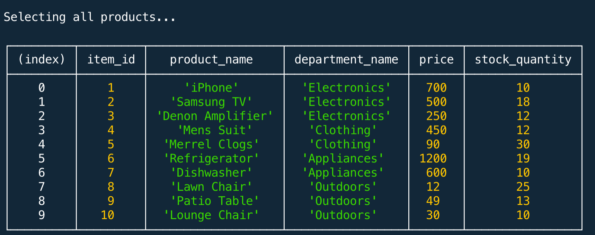

# Project Title

**Bamazon**

## Description:

Purchase your favorite items with Bamazon.

### Installing

* Clone this repository
* Run npm init -y
* Run npm install

## Built With

* Javascript
* Node.js

The app uses the following NPM packages: 

### NPM Packages

* Inquirer - provides the menu system
* MySQL - relational database to store items
* DotEnv - stores the MySQL variables

## Instructions

* Start the program by running 'node bamazonCustomer.js' in the terminal
* You will be presented with this menu:

* You have the option to Exit by typing "Y", type "N" to continue
* You will be prompted to type the index of the item your would like to purchase
* Next, type the quantity
* It will ensure there is sufficient stock, if not, it will cancel the purchase. If enough stock is present, it will complete the purchase and give you the total
* The prompts will restart until you choose to exit

## Demo (Click the Image to View the Demo Video)

## GitHub Repo
https://github.com/lmasullo/Bamazon

## Versioning

We use [SemVer](http://semver.org/) for versioning. 
Current version is 1.0

## Authors

**Larry Masullo (sole author)**

## Portfolio
https://www.masullodev.com

## License

This project is licensed under the MIT License - see the [LICENSE.md](LICENSE.md) file for details

## Acknowledgments

Thanks to the Instructors and Teaching Assistants in the UT Full Stack Coding Bootcamp for their support. 
